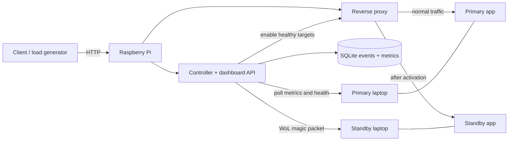
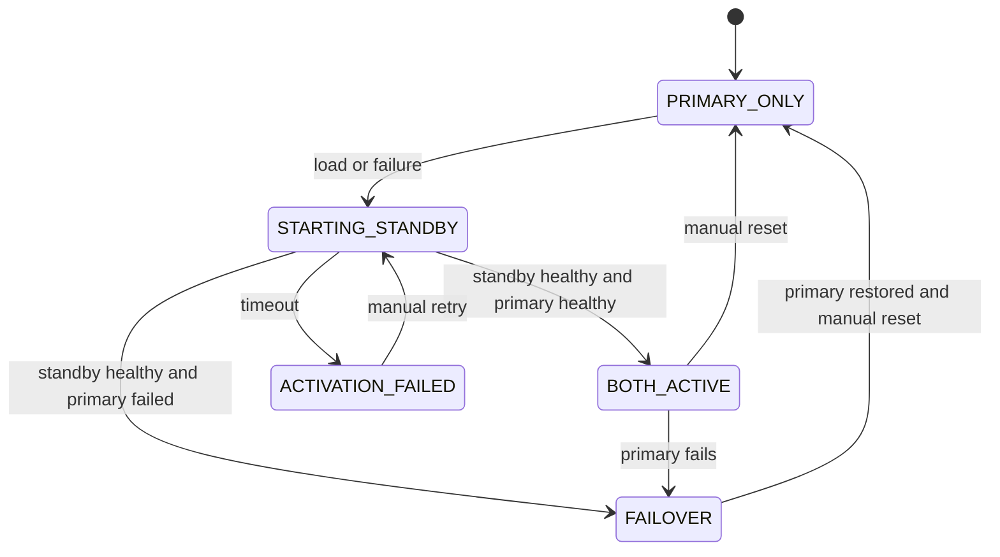

# Smart Server Monitoring and Automatic Failover

## Project summary

Build a two server prototype controlled by a Raspberry Pi. The Pi watches the primary laptop, wakes a standby laptop when the primary is overloaded or unavailable, waits for its application to become healthy, and then sends traffic to both servers or fails over to the standby. A dashboard records each decision and shows the current state.

This demonstrates physical scaling and failover with one standby laptop. It does not provide unlimited autoscaling or zero downtime.

## Why this is an IoT project

The Raspberry Pi is an independent edge controller connected to physical machines on a local network. It observes server and application signals, makes a local decision, sends a Wake-on-LAN (WoL) packet, and changes the physical infrastructure's operating state.

## System architecture



The Pi is the fixed entry point for clients and hosts the controller, dashboard API, and reverse proxy. Both laptops run the same stateless HTTP application in Docker. The primary runs a lightweight metrics agent. The Pi also probes the app directly so it can detect a failed laptop when its agent stops responding.

Use wired Ethernet and stable LAN addresses or DHCP reservations. The Pi and network switch/router must remain powered. The Pi is a single point of failure; making the controller highly available is outside the first build.

## Activation sequence

```mermaid
sequenceDiagram
    participant Client
    participant Pi as Pi controller and proxy
    participant Primary as Primary laptop
    participant Standby as Standby laptop
    Client->>Pi: HTTP request
    Pi->>Primary: Forward request
    loop Every 5 seconds
        Pi->>Primary: Poll metrics and GET /health
    end
    alt Sustained high load or primary failure
        Pi->>Pi: Record reason; enter STARTING_STANDBY
        Pi->>Standby: Send WoL packet
        Standby->>Standby: Boot; start Docker app automatically
        loop Until timeout
            Pi->>Standby: GET /health
        end
        Standby-->>Pi: 200 OK
        Pi->>Pi: Enable standby in proxy; record event
        Pi->>Standby: Forward requests
    else Standby does not become healthy
        Pi->>Pi: Keep standby out of proxy; alert operator
    end
```

If the primary fails, the proxy must stop routing to it as soon as failure is confirmed, even while the standby boots. Requests may fail until the standby is healthy. The standby application should start on boot through Docker's restart policy or a systemd managed Compose service. WoL only powers on the machine. The Pi must wait for a successful health probe before routing traffic to it.

## Decision policy for the first prototype

| Condition | Action |
| --- | --- |
| Primary healthy and CPU below 80% | Keep standby off; route to primary |
| Primary CPU at or above 80% for 60 seconds | Wake standby once; add it after health passes |
| Primary app health fails for 3 consecutive probes | Remove primary from proxy, wake standby, and route to standby after health passes |
| Standby boot or health check exceeds 3 minutes | Keep it out of the proxy; record failure and alert |
| Standby already starting or active | Suppress duplicate activation |

These are initial demo settings. CPU alone does not always predict user experience, so record request latency and error rate alongside CPU. Add memory pressure as a trigger only if the chosen workload needs it.

Use explicit states: `PRIMARY_ONLY`, `STARTING_STANDBY`, `BOTH_ACTIVE`, `FAILOVER`, and `ACTIVATION_FAILED`. Persist transitions and their reasons. Keep the standby active until a manual reset in the first version. Automatic power down needs a separate safety policy.



## Components

| Component | Responsibility |
| --- | --- |
| Pi controller | Poll metrics and health, evaluate policy, send WoL, manage states, store events |
| Reverse proxy on Pi | Give clients one address; route only to healthy, enabled app instances |
| Primary metrics agent | Expose CPU, memory, disk, network, temperature when available, and uptime |
| Application on both laptops | Serve the same stateless HTTP endpoint and `GET /health` |
| Dashboard | Show state, recent metrics, activation timeline, reasons, and failures |
| SQLite database | Keep timestamped measurements and state changes across controller restarts |

The dashboard can poll the Pi API every few seconds. SQLite is sufficient for this prototype. A separate database server and message broker would add setup work without improving the physical activation path.

## Suggested implementation stack

- **Pi:** Raspberry Pi OS, Python controller, SQLite, and Nginx or HAProxy.
- **Laptops:** Linux or another OS with confirmed WoL support, Docker Compose, and a small Python metrics agent on the primary.
- **Application:** A tiny stateless HTTP service with `/health` and an endpoint that performs measurable work.
- **Dashboard:** A simple web page served by the Pi API. React can be added after the complete activation path works.
- **Alerts:** Dashboard events first; Telegram or another external channel is an extension.

The Pi controller owns the policy and state machine. A second backend should not independently decide when to activate the standby.

## Hardware checks before coding

1. Confirm the standby supports WoL from the intended power state and enable it in firmware and the operating system. Some laptops cannot wake from full shutdown or on battery power.
2. Connect the standby through Ethernet, verify its MAC address, and test waking it from the Pi.
3. Verify that the standby boots into the application without a login. Measure WoL to healthy HTTP response time.
4. Assign stable LAN addresses and confirm clients can reach the Pi proxy.
5. Use a demo application whose requests are safe to run on either laptop. An application with sessions or local writes needs shared state before load balancing.

If WoL cannot wake the standby from shutdown, use the supported sleep state and state that limitation in the presentation.

## API and dashboard scope

Minimum controller API:

```http
GET  /api/status
GET  /api/metrics
GET  /api/events
POST /api/standby/activate
POST /api/standby/reset
```

Protect manual actions so only the operator can use them on the LAN. Do not expose the control API or metrics agent directly to the internet. Show each server's reachability, health, CPU and memory, active proxy targets, state, and time ordered event log.

## Build order

1. **Hardware proof:** Wake the standby from the Pi and start its app automatically on boot.
2. **Traffic path:** Put the Pi proxy in front of the primary app; add the standby manually after `/health` succeeds.
3. **Controller:** Add polling, sustained load and failure triggers, activation states, timeout, and event log.
4. **Visibility:** Add the dashboard and useful alerts.
5. **Demo polish:** Generate repeatable load, show before and after metrics, and document recovery.

## Demonstration and success criteria

Start with the primary serving requests and the standby in its tested low power state. Generate enough application load to exceed the threshold for 60 seconds. Show the Pi recording the trigger, sending WoL, waiting for the standby to boot, checking `/health`, and routing new requests to both laptops. Then simulate primary failure and show the proxy stop using it while the standby continues serving requests.

The activation path should need no manual step, and the dashboard should record timestamps and reasons for every transition. Measure **detection time**, **WoL to health time**, **total activation time**, and **request failures during failover**. Expect a boot delay; support any claim of uninterrupted service with measurements.

## Extensions after the core demo

- Add latency or error rate to the trigger policy.
- Send one external notification for activation and failure.
- Add automatic scale down with a long cool down period and active request checks.
- Export metrics to Prometheus and build a richer dashboard.
- Secure remote management through a VPN.
