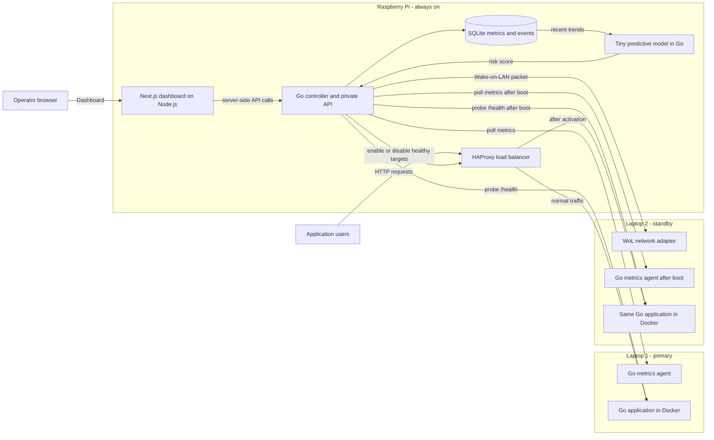
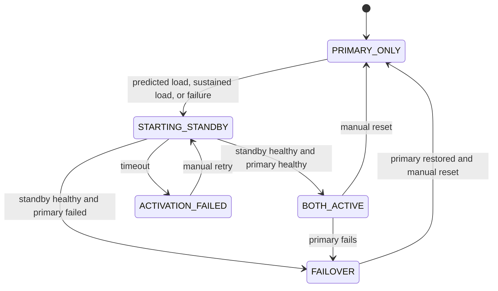
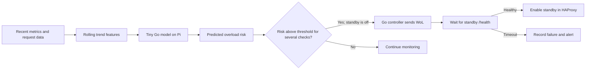
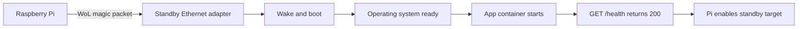

# Smart Server Monitoring and Auto-Scaling System

## Project summary

Build a two server prototype controlled by a Raspberry Pi. The Pi watches the primary laptop, wakes a standby laptop when the primary is overloaded or unavailable, waits for its application to become healthy, and then sends traffic to both servers or fails over to the standby. A dashboard records each decision and shows the current state. A small model on the Pi also predicts rising load and can wake the standby before overload occurs.

This demonstrates physical scaling and failover with one standby laptop. It does not provide unlimited autoscaling or zero downtime.

## Why this is an IoT project

The Raspberry Pi is an independent edge controller connected to physical machines on a local network. It observes server and application signals, forecasts load from recent trends, makes a local decision, sends a Wake-on-LAN (WoL) packet, and changes the physical infrastructure's operating state.

## System architecture



The Pi provides separate entry points for the application traffic and the operator dashboard. HAProxy forwards application requests to healthy laptops. The Go controller polls both laptop agents and application health endpoints, makes scaling decisions, sends WoL, updates HAProxy, and writes events to SQLite. Next.js renders the dashboard, handles operator interaction, and calls the Go API. It does not make independent scaling decisions.

Next.js runs as a Node.js service on the Pi, so its server features remain available. Keep the Go control API reachable only from the Pi or trusted LAN; Next.js server-side handlers can forward authorized operator requests. If the dashboard process fails, the Go controller and HAProxy continue handling monitoring and application traffic.

Use wired Ethernet and stable LAN addresses or DHCP reservations. The Pi and network switch/router must remain powered. The Pi is a single point of failure in this prototype; making the controller highly available is outside the first build.

## Activation sequence

```mermaid
sequenceDiagram
    participant Client
    participant Pi as Pi controller and proxy
    participant Primary as Primary laptop
    participant Standby as Standby laptop
    Client->>Pi: HTTP request
    Pi->>Primary: Forward request
    loop Every 5 seconds
        Pi->>Primary: Poll metrics and GET /health
    end
    alt Sustained high load or primary failure
        Pi->>Pi: Record reason; enter STARTING_STANDBY
        Pi->>Standby: Send WoL packet
        Standby->>Standby: Boot; start Docker app automatically
        loop Until timeout
            Pi->>Standby: GET /health
        end
        Standby-->>Pi: 200 OK
        Pi->>Pi: Enable standby in proxy; record event
        Pi->>Standby: Forward requests
    else Standby does not become healthy
        Pi->>Pi: Keep standby out of proxy; alert operator
    end
```

If the primary fails, the proxy must stop routing to it as soon as failure is confirmed, even while the standby boots. Requests may fail until the standby is healthy. The standby application should start on boot through Docker's restart policy or a systemd managed Compose service. WoL only powers on the machine. The Pi must wait for a successful health probe before routing traffic to it.

## Decision policy for the first prototype

| Condition | Action |
| --- | --- |
| Primary healthy and CPU below 80% with low predicted risk | Keep standby off; route to primary |
| Model predicts overload within the measured boot window | Wake standby early; add it only after health passes |
| Primary CPU at or above 80% for 60 seconds | Wake standby once; add it after health passes |
| Primary app health fails for 3 consecutive probes | Remove primary from proxy, wake standby, and route to standby after health passes |
| Standby boot or health check exceeds 3 minutes | Keep it out of the proxy; record failure and alert |
| Standby already starting or active | Suppress duplicate activation |

These are initial demo settings. CPU alone does not always predict user experience, so record request latency and error rate alongside CPU. Add memory pressure as a trigger only if the chosen workload needs it.

Use explicit states: `PRIMARY_ONLY`, `STARTING_STANDBY`, `BOTH_ACTIVE`, `FAILOVER`, and `ACTIVATION_FAILED`. Persist transitions and their reasons. Keep the standby active until a manual reset in the first version. Automatic power down needs a separate safety policy.



## AI-assisted predictive scaling

A small model on the Raspberry Pi can watch recent trends and wake Laptop 2 **before** the primary reaches the reactive threshold. This matters because WoL, boot, and application startup take time. The model augments the fixed load and failure rules; it does not control HAProxy directly.

### Model and inputs

Use a tiny **logistic regression classifier implemented in Go**. It runs inside the Pi controller and stores a small versioned weight file. It predicts the risk that the primary will become overloaded within a future window. Start with a prediction horizon based on the measured WoL-to-healthy boot time plus a safety margin; for example, a 90-second boot suggests a roughly two-minute horizon.

Build one feature vector from the most recent five minutes of samples:

| Feature | What it captures |
| --- | --- |
| Average CPU and CPU slope | Current pressure and how quickly it is rising |
| Request rate and request-rate slope | Incoming demand, including a traffic ramp |
| p95 request latency and its slope | User-visible slowdown |
| RAM utilization | Capacity pressure |
| Recent error rate | Application stress or failure |

The output is a risk score from 0 to 1 plus a model version and timestamp. The controller can display the score in the dashboard. It should treat missing or stale inputs as **prediction unavailable**, rather than silently turning them into zeros.

### Prediction to action



For the first experiment, a risk score of at least 0.8 on three consecutive evaluations can start the standby. This value must be tuned against measured false alarms and missed overloads. Once activation starts, the normal state machine prevents duplicate WoL packets. The standby joins traffic only after its health check succeeds.

The deterministic rules remain active at all times: three failed primary health checks trigger failover, and sustained CPU above 80% triggers reactive activation. If the model is unavailable, has too little training data, or sees stale metrics, the system continues with those rules. The model is allowed to pre-wake the standby; it does not automatically power a server down in the first version.

### Training and evaluation

Collect timestamped traces from repeatable **steady**, **gradual ramp**, and **sudden burst** workloads. For the first version, label a sample positive when the fixed CPU overload rule will fire within the selected prediction horizon. Later experiments can also label a configurable latency target. Keep whole workload runs separate between training and evaluation so nearby samples do not leak into both sets. Train the small model with Go on a development laptop, then deploy only the learned weights to the Pi for local inference. Retraining can be done after more traces are collected; the currently deployed model version must be recorded with every prediction-driven event.

Compare the predictive policy against the fixed-threshold policy on separate demo runs. Report prediction lead time, missed overloads, unnecessary wake-ups, activation time, request errors, and the Pi CPU/RAM used by inference. A useful model wakes the standby early enough to reduce degraded service without repeatedly waking it during harmless spikes. Related research: [Predictive Auto-scaling with OpenStack Monasca](https://arxiv.org/abs/2111.02133) studies forecasts when server startup takes time.

### Later: AI-guided scale down

After predictive scale up is reliable, the same trend score can help decide when Laptop 2 is no longer needed. Require low predicted overload risk for a longer window, low measured load, a healthy primary, and a cool-down period. The Go controller should first drain Laptop 2 from HAProxy, wait for in-flight requests to finish, and only then suspend it into a WoL-compatible state. If the primary becomes unhealthy during the drain, cancel the scale down. Keep a manual override. This is an extension after the first physical activation demo, because premature scale down could cause repeated wake/suspend cycles.

## Components

| Component | Responsibility |
| --- | --- |
| Pi controller | Poll metrics and health, evaluate rules and model score, send WoL, manage states, store events |
| Pi prediction model | Forecast overload risk from recent trends and report its model version |
| Reverse proxy on Pi | Give clients one address; route only to healthy, enabled app instances |
| Laptop metrics agents | Expose CPU, memory, disk, network, temperature when available, and uptime |
| Application on both laptops | Serve the same stateless HTTP endpoint and `GET /health` |
| Next.js dashboard | Show state, recent metrics, activation timeline, reasons, and failures |
| SQLite database | Keep timestamped measurements and state changes across controller restarts |

The Next.js dashboard can poll its own server-side routes every few seconds; those routes call the private Go API. SQLite is sufficient for this prototype. A separate database server and message broker would add setup work without improving the physical activation path.

## Selected technology stack

| Layer | Choice | Purpose and placement |
| --- | --- | --- |
| Edge hardware and OS | Raspberry Pi with 64-bit Raspberry Pi OS; two laptops on wired Ethernet | Pi stays on; Laptop 1 serves normally; Laptop 2 is the WoL standby |
| Controller and backend API | Go with the standard `net/http` package | One Pi service owns polling, thresholds, health checks, state transitions, WoL, alerts, and operator API |
| Predictive model | Tiny Go logistic regression classifier with a versioned weight file | Runs on the Pi and estimates overload risk before standby boot time |
| Laptop metrics agents | Go with `github.com/shirou/gopsutil/v4` for OS metrics | Agent runs on each laptop and reports CPU, memory, disk, network, temperature when available, and uptime |
| Demo application | Go HTTP service | Same stateless application image on both laptops; exposes `GET /health` and identifies the serving laptop |
| Frontend | Next.js App Router, React, and TypeScript | Operator dashboard and controls; runs as a Node.js service on the Pi |
| Styling and charts | Tailwind CSS and Recharts | Dashboard layout, status views, CPU/RAM/network charts, and event timeline |
| Frontend to backend connection | Next.js server components and route handlers calling the Go API | Next.js renders data and forwards authorized operator actions; Go remains the only scaling decision maker |
| Live updates | Dashboard polling about every 5 seconds | Refreshes current state, metrics, health, and events; server-sent events can be added later |
| Database | SQLite through Go `database/sql` and `modernc.org/sqlite` (pure Go driver) | Stores timestamped metrics, states, activation reasons, alerts, and errors on the Pi |
| Load balancer | HAProxy with health checks and runtime control | Pi routes application traffic only to healthy, enabled laptops |
| Wake and network | Wake-on-LAN magic packet from Go over wired LAN | Powers or resumes Laptop 2 using its MAC address |
| Application deployment | Docker and Docker Compose | Runs the same Go application on both laptops and restarts it after boot |
| Service startup | systemd | Starts the Pi controller, Next.js dashboard, and laptop metrics agents automatically |
| Operator access | Authenticated dashboard actions and a Go API restricted to the Pi or trusted LAN | Prevents arbitrary wake, retry, reset, and proxy changes |
| Alerts and logs | Dashboard event feed and structured Go logs; one external channel later | Makes decisions, failures, and recovery visible for the demonstration |

### Runtime boundaries

- **Go controller:** owns the scaling state machine and writes SQLite. Next.js must never send WoL packets or edit HAProxy directly.
- **Next.js:** owns the dashboard experience and operator access. Its server-side code calls the Go API; browser clients do not need direct access to the private Go API.
- **HAProxy:** owns application traffic routing. The dashboard runs as a separate Pi service, so a dashboard outage does not stop the Go controller or application proxy.
- **Laptop services:** each laptop runs the Go app and metrics agent after boot. Only the standby app is added to HAProxy after it passes `/health`.

Next.js is deployed as a Node.js server on the Pi, preserving App Router server features. Go is used for the hardware facing control path and agents. The existing scaffold remains as it was; we will discuss its final structure and any Git revert before implementing components.

## Hardware checks before coding

1. Confirm the standby supports WoL from the intended power state and enable it in firmware and the operating system. Some laptops cannot wake from full shutdown or on battery power.
2. Connect the standby through Ethernet, verify its MAC address, and test waking it from the Pi.
3. Verify that the standby boots into the application without a login. Measure WoL to healthy HTTP response time.
4. Assign stable LAN addresses and confirm clients can reach the Pi proxy.
5. Use a demo application whose requests are safe to run on either laptop. An application with sessions or local writes needs shared state before load balancing.

If WoL cannot wake the standby from shutdown, use the supported sleep state and state that limitation in the presentation.

## API and dashboard scope

Minimum controller API:

```http
GET  /api/status
GET  /api/predictions
GET  /api/metrics
GET  /api/events
POST /api/standby/activate
POST /api/standby/reset
```

Protect manual actions with operator authentication in Next.js and authorization in the Go API. Do not expose the control API or metrics agent directly to the internet. Show each server's reachability, health, CPU and memory, active proxy targets, state, and time ordered event log.

## Build order

1. **Hardware proof:** Wake the standby from the Pi and start its app automatically on boot.
2. **Traffic path:** Put the Pi proxy in front of the primary app; add the standby manually after `/health` succeeds.
3. **Controller:** Add polling, sustained load and failure triggers, activation states, timeout, and event log.
4. **Prediction:** Collect workload traces, train the small Go model, and compare its decisions with the fixed thresholds.
5. **Visibility:** Add the dashboard and useful alerts.
6. **Demo polish:** Generate repeatable load, show before and after metrics, and document recovery.

## Demonstration and success criteria

Start with the primary serving requests and the standby in its tested low power state. Generate enough application load to exceed the threshold for 60 seconds. Show the Pi recording the trigger, sending WoL, waiting for the standby to boot, checking `/health`, and routing new requests to both laptops. Then simulate primary failure and show the proxy stop using it while the standby continues serving requests.

The activation path should need no manual step, and the dashboard should record timestamps and reasons for every transition. Measure **detection time**, **WoL to health time**, **total activation time**, and **request failures during failover**. Expect a boot delay; support any claim of uninterrupted service with measurements. For the AI run, also compare prediction lead time, false wake-ups, missed overloads, and request failures with the fixed-threshold run.

## Detailed monitoring design

The original monitoring idea includes CPU, RAM, disk, disk I/O, network traffic, temperature, uptime, application health, and request latency. The first implementation can collect the core signals and add the others as the hardware allows.

| Metric | Source | Display and use |
| --- | --- | --- |
| CPU utilization | Laptop agent | Main sustained load trigger and chart |
| RAM utilization | Laptop agent | Capacity warning and chart |
| Disk used and disk I/O | Laptop agent | Diagnose storage pressure |
| Network in/out | Laptop agent | Show how traffic changes after activation |
| Temperature | Laptop sensors, when supported | Hardware warning; do not assume every laptop exposes it |
| Uptime | Laptop agent | Explain boots and restarts |
| Application health | Pi directly calls `/health` | Determines proxy eligibility |
| Request rate and latency | Proxy or application | Show whether scaling improved user experience |
| Error count | Proxy or application | Show availability during failover |

Example of a timestamped sample:

```text
Time:         09:41:00
Server:       laptop-1
CPU:          91%
RAM:          84%
Disk used:    63%
Network in:   12 Mbps
Temperature:  65 C
App health:   HEALTHY
Latency p95:  420 ms
```

The Pi should poll about every 5 seconds and store server ID, timestamp, measured value, and collection result. Missing data must be shown as unavailable, not as zero. A failed metrics agent is different from a failed application: if the agent stops but `/health` still succeeds, keep serving traffic and alert that metrics are stale.

### Load levels and trigger

```text
CPU below 60%             NORMAL
CPU 60% to below 80%      WARNING
CPU 80% to below 90%      HIGH
CPU 90% or above          CRITICAL
```

These levels are for the dashboard. The actual scale trigger is CPU at or above 80% for 60 continuous seconds. Keeping display severity separate from the trigger prevents every warning from starting the standby. Save thresholds in configuration so they can be adjusted for the chosen workload. CPU is a controlled demo signal; record latency and errors to judge whether adding Laptop 2 actually helped.

## Wake-on-LAN and boot readiness

The Pi sends a WoL magic packet to the standby Ethernet adapter using its MAC address. The packet only wakes the laptop. The operating system and Docker must then start, followed by the application. The Pi must wait for the application to become healthy before changing the proxy.



Hardware checks to perform before coding the automation:

1. Verify that the standby can wake from the desired power state. Some laptops support wake from sleep but not full shutdown, and some require AC power.
2. Enable WoL in firmware and the operating system, use Ethernet, and record the standby MAC address.
3. Send a test packet from the Pi several times and check that the result is repeatable.
4. Make the application start without a user login, using Docker restart policy or a systemd managed Compose service.
5. Measure the interval from WoL send to a successful health response. Use that measurement to set a realistic startup timeout.

If shutdown wake is unsupported, use a supported sleep state and describe it in the report. This is a hardware constraint, not a failure of the software design.

## Application deployment and data consistency

Both laptops should run the same Docker image and expose the same HTTP routes. A small stateless demo app is easiest to balance: it can return its server name and perform a measurable workload. A simple `GET /health` route returns HTTP 200 only when the app is ready to serve requests.

```text
Laptop 1                         Laptop 2
- Docker                         - Docker
- Application container          - Same application image
- Metrics agent                  - App starts on boot
- Metrics agent starts on boot
- /health endpoint               - /health endpoint
```

A powered-on laptop or running Docker daemon does not prove the app is ready. If the chosen application stores sessions, uploads, or other data on one laptop, requests routed to both instances may see inconsistent state. Use a stateless service for the first demo or add a shared data store as a separate extension.

## Load balancing behavior

The Pi proxy gives users one address throughout the demonstration.

```text
Normal:
Users -> Pi reverse proxy -> Laptop 1

After scale up:
                           +-> Laptop 1
Users -> Pi reverse proxy -+
                           +-> Laptop 2

After primary failure:
Users -> Pi reverse proxy -> Laptop 2
```

For overload, keep Laptop 1 in the pool if healthy and distribute new requests across both servers. For failure, remove Laptop 1 as soon as failure is confirmed, even if Laptop 2 is still booting. Requests can fail until the standby becomes healthy; measure and report that gap. HAProxy is a practical first choice because its runtime controls and health checks suit changing backend membership. Nginx is possible with a carefully managed configuration update and reload. Log which backend served each request so the demo proves that traffic actually shifted.

## Backend API details

The Pi API connects the controller, dashboard, and manual operator controls. The initial route list can be expanded from the core API as follows:

```http
GET  /api/status
GET  /api/predictions
GET  /api/servers
GET  /api/servers/:id
GET  /api/servers/:id/metrics
GET  /api/servers/:id/health
GET  /api/events
GET  /api/alerts

POST /api/standby/activate
POST /api/standby/retry
POST /api/standby/reset
```

The manual activate command should use the same state machine, health gate, and event logging as automatic activation. The reset command should require a healthy primary before removing the standby from the proxy. Automatic shutdown is outside the first version. Restrict mutation routes to the operator on the LAN. The metrics agent endpoint should not be publicly reachable.

Example status response:

```json
{
  "state": "BOTH_ACTIVE",
  "reason": "primary_cpu_above_80_percent_for_60_seconds",
  "activeServers": ["laptop-1", "laptop-2"],
  "standbyHealth": "healthy",
  "lastTransitionAt": "2026-10-06T09:42:21Z"
}
```

## Dashboard and alert details

The Next.js dashboard should answer four questions quickly: which laptops serve traffic, why the state changed, what overload risk the model predicts, and whether availability or performance improved.

Use Tailwind CSS for the interface and Recharts for historical charts. Show current server status, predicted overload risk and model version, CPU/RAM/network values, historical charts, active and standby servers, application health, request latency, error counts, uptime, and a time ordered event history. Mark a measurement as stale when its last sample is old. Operator controls can provide manual activate, retry, and reset.

```text
SMART SERVER MONITOR                 State: BOTH_ACTIVE

Laptop 1  ACTIVE  HEALTHY  CPU 54%   Latency p95 120 ms
Laptop 2  ACTIVE  HEALTHY  CPU 41%   Latency p95 110 ms

09:40:30  AI forecast: 0.82 overload risk within 2 minutes
09:40:45  Wake-on-LAN sent early to Laptop 2
09:41:00  Fixed CPU rule fires; activation already in progress
09:42:20  Laptop 2 health check passed
09:42:21  Laptop 2 added to proxy
```

Alert examples:

| Severity | Event |
| --- | --- |
| WARNING | Primary CPU exceeded 80% |
| CRITICAL | Primary app failed three health checks; failover started |
| INFO | WoL packet sent to standby |
| INFO | Model predicted overload; early wake triggered |
| WARNING | Prediction unavailable; fixed rules remain active |
| SUCCESS | Standby passed health check and joined the proxy |
| ERROR | Standby did not become healthy before timeout |

The dashboard event feed is the first notification channel. Email, Telegram, Discord, or browser notifications can be added later; choose one external channel if time allows. Send alerts on state changes rather than on every polling cycle. Each event should record time, server, reason, previous state, new state, and outcome. SQLite is enough for this small prototype; PostgreSQL is a later option for larger retention or a separate backend.

## Failure handling and recovery

| Failure | Expected behavior |
| --- | --- |
| Primary application fails | Remove it from proxy, wake standby, alert |
| Primary metrics agent fails but app is healthy | Continue serving, mark metrics unavailable, alert |
| WoL packet has no effect | Wait until timeout, record activation failure, alert |
| Standby boots but app does not | Keep it out of proxy and record health failure |
| Standby fails while both are active | Remove standby; continue on healthy primary |
| Pi controller restarts | Recheck both apps and reconcile proxy targets with actual health |
| Model unavailable or input metrics stale | Continue fixed-threshold and failure rules; show prediction unavailable |
| Pi or network switch fails | Service entry point is unavailable; state as prototype limitation |

Persist state transitions, but do not blindly trust saved state after a restart. The Pi should probe actual health and inspect proxy targets before resuming decisions.

## Demonstration walkthrough and measurements

1. **Normal state:** Laptop 1 serves requests, Laptop 2 is off or asleep, and the dashboard shows `PRIMARY_ONLY`.
2. **Generate load:** Run repeatable traffic against the app. Show CPU rising through the warning and high levels. Wait for the 60 second trigger window.
3. **Automatic scale up:** Show the recorded trigger, WoL packet, `STARTING_STANDBY`, successful health check, proxy change, and `BOTH_ACTIVE`. Show requests reaching both server names.
4. **Warm failure test:** With both laptops active, stop the primary app. After three failed probes, show the proxy stop routing to it and the state change to `FAILOVER`.
5. **Cold failure test:** Reset to primary only, then stop the primary. Measure failed requests while the standby boots. This demonstrates the limit of an off or sleeping standby.
6. **Failed activation test:** Prevent standby startup or health from succeeding and show timeout, `ACTIVATION_FAILED`, and an error alert.
7. **Predictive comparison:** Repeat a gradual traffic ramp with model prediction enabled and compare early wake time, request errors, and unnecessary wake-ups against the fixed-threshold run.

Record detection time, WoL to health time, total activation time, request failures during cold and warm failover, and CPU/latency before and after activation. The demo succeeds when the Pi completes the activation path without manual steps, the proxy routes only to healthy servers, and the dashboard gives an accurate timeline and reason for every result.

## Extensions after the core demo

- Add latency or error rate to the trigger policy.
- Send one external notification for activation and failure.
- Add AI-guided scale down with a long cool down period, active request checks, and standby draining.
- Export metrics to Prometheus and build a richer dashboard.
- Secure remote management through a VPN.
